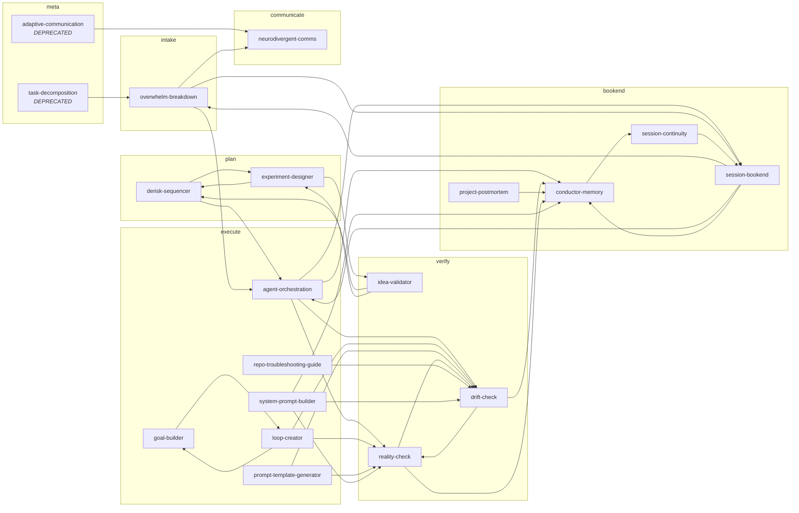

wrote: /Users/dkennedy/dev/projects/skills/skill-graph.md
rom the skill source directories._
_If this drifts from `COORDINATION-STATUS.md`, the source wins — update the doc._

## Phase × handoffs

| Skill | phase | hands_off_to | notes |
|---|---|---|---|
| `overwhelm-breakdown` | intake | agent-orchestration, neurodivergent-comms, session-bookend |  |
| `derisk-sequencer` | plan | experiment-designer, agent-orchestration |  |
| `experiment-designer` | plan | idea-validator, derisk-sequencer |  |
| `agent-orchestration` | execute | reality-check, drift-check, conductor-memory, session-bookend |  |
| `goal-builder` | execute | loop-creator |  |
| `loop-creator` | execute | reality-check, drift-check, goal-builder |  |
| `prompt-template-generator` | execute | drift-check, reality-check |  |
| `repo-troubleshooting-guide` | execute | drift-check |  |
| `system-prompt-builder` | execute | reality-check, drift-check, conductor-memory |  |
| `drift-check` | verify | reality-check, conductor-memory |  |
| `idea-validator` | verify | derisk-sequencer, experiment-designer |  |
| `reality-check` | verify | drift-check, conductor-memory |  |
| `neurodivergent-comms` | communicate | — |  |
| `conductor-memory` | bookend | session-continuity |  |
| `project-postmortem` | bookend | conductor-memory |  |
| `session-bookend` | bookend | overwhelm-breakdown, agent-orchestration, conductor-memory |  |
| `session-continuity` | bookend | session-bookend |  |
| `adaptive-communication` | meta | neurodivergent-comms | DEPRECATED tombstone |
| `task-decomposition` | meta | overwhelm-breakdown | DEPRECATED tombstone |

## Handoff graph

## Source

Generated 2026-06-29 10:40 CDT from 19 skill(s).
