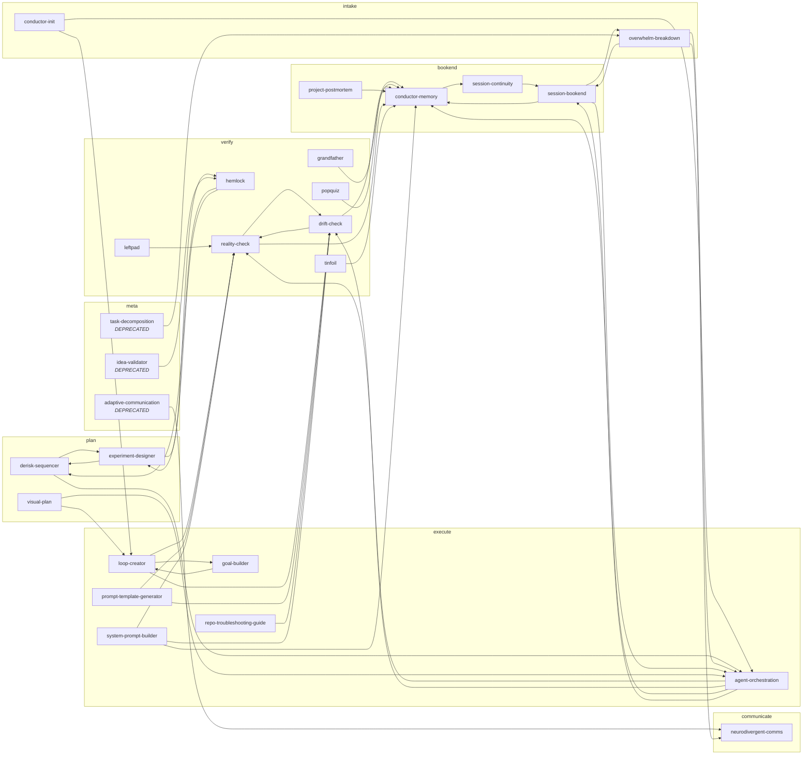

# Skill graph

_Auto-generated by `tools/skill-graph.sh` from the skill source directories._
_If this drifts from the skill directories, the source wins — regenerate with `tools/skill-graph.sh`._

## Phase × handoffs

| Skill | phase | hands_off_to | notes |
|---|---|---|---|
| `conductor-init` | intake | loop-creator, agent-orchestration |  |
| `overwhelm-breakdown` | intake | agent-orchestration, neurodivergent-comms, session-bookend |  |
| `derisk-sequencer` | plan | experiment-designer, agent-orchestration |  |
| `experiment-designer` | plan | hemlock, derisk-sequencer |  |
| `visual-plan` | plan | agent-orchestration, loop-creator |  |
| `agent-orchestration` | execute | reality-check, drift-check, conductor-memory, session-bookend |  |
| `goal-builder` | execute | loop-creator |  |
| `loop-creator` | execute | reality-check, drift-check, goal-builder |  |
| `prompt-template-generator` | execute | drift-check, reality-check |  |
| `repo-troubleshooting-guide` | execute | drift-check |  |
| `system-prompt-builder` | execute | reality-check, drift-check, conductor-memory |  |
| `drift-check` | verify | reality-check, conductor-memory |  |
| `grandfather` | verify | conductor-memory |  |
| `hemlock` | verify | derisk-sequencer, experiment-designer |  |
| `leftpad` | verify | reality-check |  |
| `popquiz` | verify | conductor-memory |  |
| `reality-check` | verify | drift-check, conductor-memory |  |
| `tinfoil` | verify | conductor-memory |  |
| `neurodivergent-comms` | communicate | — |  |
| `conductor-memory` | bookend | session-continuity |  |
| `project-postmortem` | bookend | conductor-memory |  |
| `session-bookend` | bookend | overwhelm-breakdown, agent-orchestration, conductor-memory |  |
| `session-continuity` | bookend | session-bookend |  |
| `adaptive-communication` | meta | neurodivergent-comms | DEPRECATED tombstone |
| `idea-validator` | meta | hemlock | DEPRECATED tombstone |
| `task-decomposition` | meta | overwhelm-breakdown | DEPRECATED tombstone |

## Handoff graph

```mermaid
graph LR
  subgraph intake
    conductor-init
    overwhelm-breakdown
  end
  subgraph plan
    derisk-sequencer
    experiment-designer
    visual-plan
  end
  subgraph execute
    agent-orchestration
    goal-builder
    loop-creator
    prompt-template-generator
    repo-troubleshooting-guide
    system-prompt-builder
  end
  subgraph verify
    drift-check
    grandfather
    hemlock
    leftpad
    popquiz
    reality-check
    tinfoil
  end
  subgraph communicate
    neurodivergent-comms
  end
  subgraph bookend
    conductor-memory
    project-postmortem
    session-bookend
    session-continuity
  end
  subgraph meta
    adaptive-communication["adaptive-communication<br/><i>DEPRECATED</i>"]
    idea-validator["idea-validator<br/><i>DEPRECATED</i>"]
    task-decomposition["task-decomposition<br/><i>DEPRECATED</i>"]
  end
  adaptive-communication --> neurodivergent-comms
  agent-orchestration --> reality-check
  agent-orchestration --> drift-check
  agent-orchestration --> conductor-memory
  agent-orchestration --> session-bookend
  conductor-init --> loop-creator
  conductor-init --> agent-orchestration
  conductor-memory --> session-continuity
  derisk-sequencer --> experiment-designer
  derisk-sequencer --> agent-orchestration
  drift-check --> reality-check
  drift-check --> conductor-memory
  experiment-designer --> hemlock
  experiment-designer --> derisk-sequencer
  goal-builder --> loop-creator
  grandfather --> conductor-memory
  hemlock --> derisk-sequencer
  hemlock --> experiment-designer
  idea-validator --> hemlock
  leftpad --> reality-check
  loop-creator --> reality-check
  loop-creator --> drift-check
  loop-creator --> goal-builder
  overwhelm-breakdown --> agent-orchestration
  overwhelm-breakdown --> neurodivergent-comms
  overwhelm-breakdown --> session-bookend
  popquiz --> conductor-memory
  project-postmortem --> conductor-memory
  prompt-template-generator --> drift-check
  prompt-template-generator --> reality-check
  reality-check --> drift-check
  reality-check --> conductor-memory
  repo-troubleshooting-guide --> drift-check
  session-bookend --> overwhelm-breakdown
  session-bookend --> agent-orchestration
  session-bookend --> conductor-memory
  session-continuity --> session-bookend
  system-prompt-builder --> reality-check
  system-prompt-builder --> drift-check
  system-prompt-builder --> conductor-memory
  task-decomposition --> overwhelm-breakdown
  tinfoil --> conductor-memory
  visual-plan --> agent-orchestration
  visual-plan --> loop-creator
```

## Source

Generated 2026-07-28 22:38 CDT from 26 skill(s).
